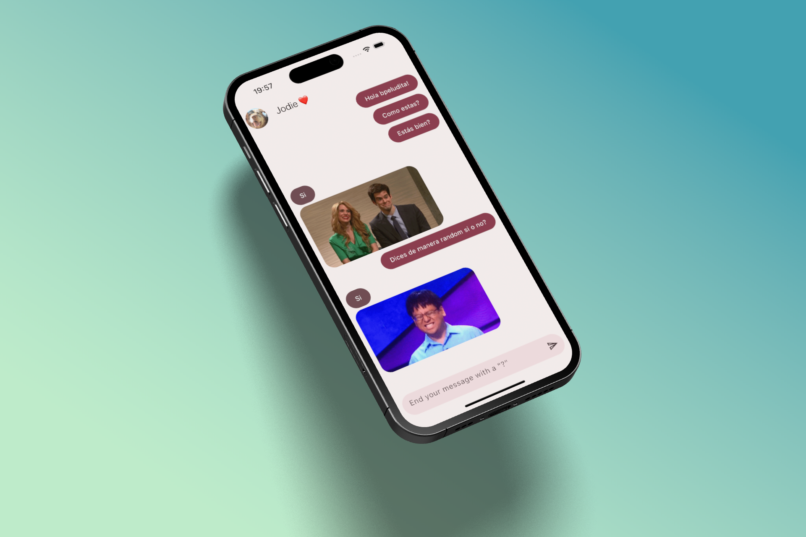

# Yes / No App 💬

Sample Flutter application built as part of **Fernando Herrera’s Flutter course**.

The app sends a request to the public API **https://yesno.wtf** and displays a **yes / no** answer with an animated GIF, presented in a chat-style UI.

---

## What’s inside

- HTTP requests
- Basic state management with **Provider**
- Models & services
- Chat-like UI built with Flutter

---

## How it works (quick overview)

1. The user writes and sends a message.
2. The provider adds the user message and requests an answer from the API.
3. The API returns a response (`yes` / `no`) plus a GIF URL.
4. The automatic reply is rendered in the chat message list.

---

## Key structure

- `lib/main.dart` — App entry point; registers Provider and launches `ChatScreen`.
- `lib/presentation/screens/chat/chat_screen.dart` — Chat UI.
- `lib/presentation/providers/chat_provider.dart` — Message logic and API interaction.
- `lib/config/helpers/get_yes_no_answer.dart` — HTTP client for `https://yesno.wtf/api`.
- `lib/domain/entities/message.dart` — `Message` entity.
- `lib/config/theme/app_theme.dart` — App theme configuration.

---

## Main dependencies

- `flutter`
- `provider`
- `http` (or any HTTP client used for requests)

---

## Run the app

```bash
flutter pub get
flutter run
```


## Screenshots

<p align="center">
	
</p>
